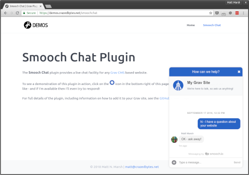

# Grav Smooch Chat Plugin

This **Smooch Chat** plugin provides a way to add a live chat facility to any [Grav CMS](https://getgrav.org/) site, by 
integrating the [Smooch.io](https://smooch.io/) Web Messenger. This allows you to chat to your visitors live in
real-time.



You can try out a [plugin demonstration](https://demos.crazedbytes.net/smoochchat) to see the user experience.

## Plugin Installation

> NOTE: GPM or admin panel installation of this plugin is not yet available.  

### Manual Installation

To install this plugin manually, just download the zip version of this repository and unzip it under 
`<Grav install path>/user/plugins`. Then, rename the folder to `smoochchat`. You can find these files on 
[GitHub](https://github.com/marshmn/grav-plugin-smoochchat).

You should now have all the plugin files under: `<Grav install path>/user/plugins/smoochchat`
	
## Smooch Configuration

You'll need to have a [Smooch.io](https://smooch.io/) account to make use of this plugin.

> NOTE: You can sign up for a 'free trial' account of Smooch which will give you access to the full set of Smooch 
  features for a limited time. Once the trial has expired your account will lose access to the paid features, but will 
  still function for live chat as a free 'labs' account.

If you're not already set up with Smooch, here's what you'll need to do:

1. Sign-up for a free trial Smooch account at: [https://smooch.io]()
2. Create an 'app' within Smooch
3. From within the Smooch admin connect the 'Web Messenger' integration to your app

Once you have done the above, you can complete the plugin configuration below.

In order for you to receive messages and chat with your visitors, you will need to add another integration to your 
Smooch app. For example, you could add the 'Slack' integration and connect that to a Slack account. This way you will
receive incoming chat messages within your Slack app.
	
## Plugin Configuration

If you're using the Grav admin panel plugin, then all settings can be configured through the Smooch Chat plugin page
within it. Alternatively, if you're modifying the configuration by hand, you should copy the 
`user/plugins/smoochchat/smoochchat.yaml` to `user/config/plugins/smoochchat.yaml` and only edit that copy.

Here is the default configuration and an explanation of available options:

```yaml
enabled: true
app_id:
```

 - **enabled:** Sets whether the plugin is active or not
 - **app_id:** The Smooch app ID to connect with - this needs to be set to the app ID from within the Smooch settings in
   order for the plugin to function

> NOTE: if you use the admin panel plugin, a file with your configuration, and named `smoochchat.yaml` will be saved in 
  the `user/config/plugins/` folder once the configuration is saved in the admin.
